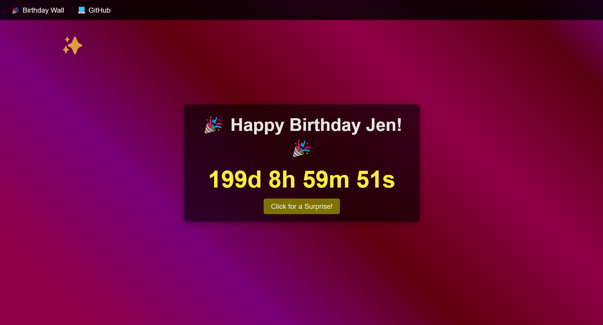
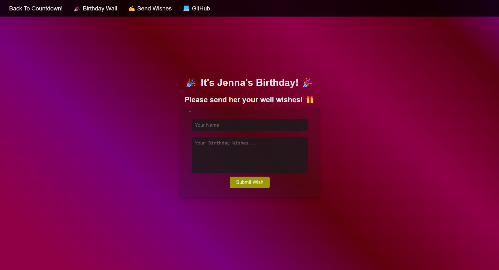
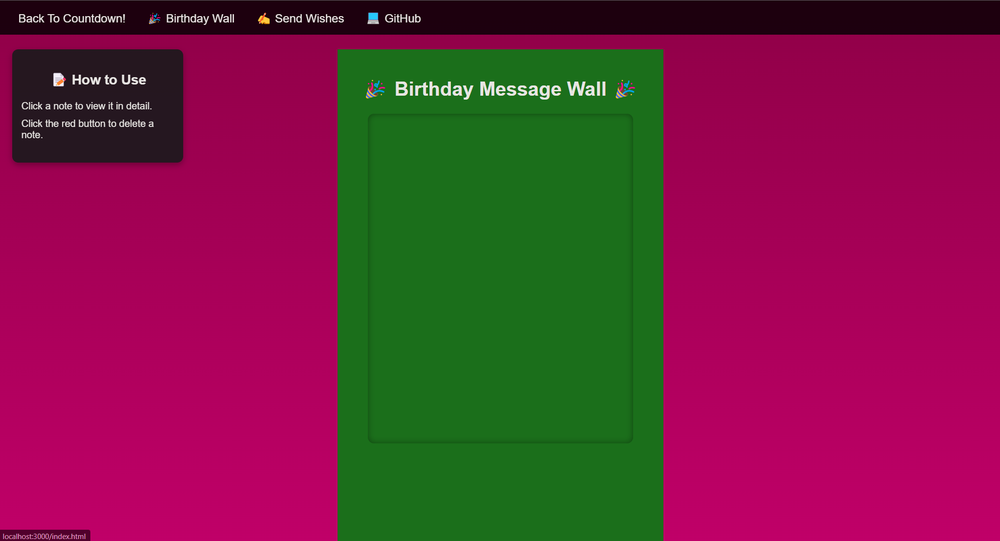

# Happy Birthday Jenna! 🎊

{:toc}

It's a birthday website for somebody special.

This is very much worth the time and the effort!

I really do hope you appreciate it 😄. (AND I HOPE THIS IS SATISFACTORY)

Current Website can be found [here](https://happy-birthday-website-hwrrxw091-cyrolites-projects.vercel.app/).

## Inspiration

This project was started on 16 Mar 2025, when I was lying in my bed (thinking of what to do next).

I was thinking of what to do (amidst drowning in school projects as well as homework)... that's when I realised that I could embark myself on a humble project.

But who can I offer this to? That's when I thought of you! 😄

# Development
## Early Iterations (Technical)

During the early iterations of development, as a novice web developer, I attempted to self-teach myself the basic CSS / HTML commands.

I also self-taught myself on web deployment using Vercel, and learnt about json packages, as well as HTML / CSS formatting.

In further iterations of the development (20 Mar 2025), I created a send wishes page for well-wishers to be able to send their well wishes through the app.

In addition, I also added a birthday board. Early iterations could be seen above. There was a lot of problem formatting and debugging (for example, there was a bug where the pop-up will show up even though I clicked on the close button). The problem was later fixed.

Further developments are coming... Stay tuned!

Do let me know if there are any improvements needed for this webpage!